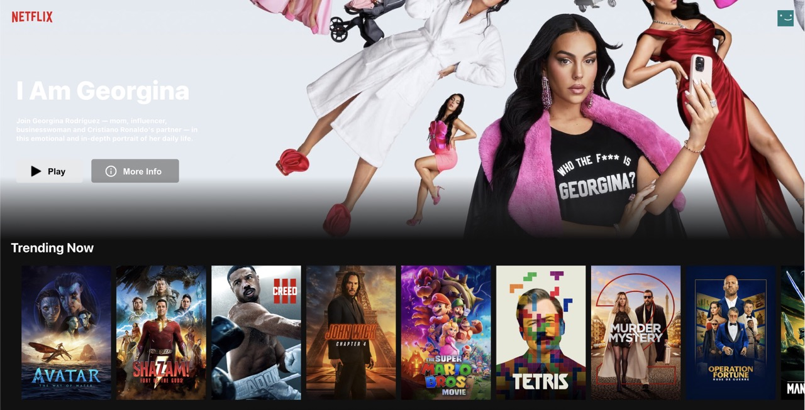

# Netflix Clone
This project is a simplified version of a Netflix Clone, where you can view a list of movies and watch their trailers using the YouTube npm package. It is built using React and Firebase, and uses the [The Movie Database API](https://api.themoviedb.org/3) to fetch movie information.



## Table of Contents

-   [Features](https://chat.openai.com/chat?model=gpt-4#features)
-   [Prerequisites](https://chat.openai.com/chat?model=gpt-4#prerequisites)
-   [Installation](https://chat.openai.com/chat?model=gpt-4#installation)
-   [Usage](https://chat.openai.com/chat?model=gpt-4#usage)
-   [Acknowledgements](https://chat.openai.com/chat?model=gpt-4#acknowledgements)

## Features

-   Responsive design
-   Movie list with search functionality
-   Movie detail pop-up with trailer from YouTube
-   Firebase hosting

## Prerequisites

-   [Node.js](https://nodejs.org/en/) (v16.x.x recommended)
-   [npm](https://www.npmjs.com/get-npm) (v6.x.x recommended)
-   A [Firebase](https://firebase.google.com/) account
-   A [The Movie Database API](https://www.themoviedb.org/documentation/api) key

## Installation

1.  Clone the repository:
    
    ```
    git clone https://github.com/yourusername/netflix-clone.git
    ``` 
    
2.  Change to the project directory:
    
    ```
    cd netflix-clone
    ``` 
    
3.  Install the dependencies:
    
    ```
    npm install
    ``` 
    
4.  Create a `.env` file in the root folder with your API key:
   
    ```
    API_KEY=your_api_key_here
    ```
    
5.  Initialize Firebase and set up hosting:
    
    -   Install the Firebase CLI:
        ```
        npm install -g firebase-tools
        ``` 
        
    -   Log in to your Firebase account:e
        
        ```
        firebase login
        ``` 
        
    -   Initialize Firebase in the project directory:

        ```
        firebase init
        ``` 
        
    -   Follow the commands to set up Firebase hosting.
        

## Usage

1.  Start the development server:
    
    ```
    npm start
    ``` 
    
2.  Open [http://localhost:3000](http://localhost:3000/) to view the app in your browser.
    
3.  To build and deploy the app to Firebase Hosting:
   
    `npm run build
    firebase deploy` 
    
    Your app will be available at `https://your-app-id.web.app` and `https://your-app-id.firebaseapp.com`.
    

## Acknowledgements

-   [React](https://reactjs.org/)
-   [Firebase](https://firebase.google.com/)
-   [The Movie Database API](https://www.themoviedb.org/documentation/api)
-   [YouTube npm package](https://www.npmjs.com/package/youtube)
-   [Create React App](https://github.com/facebook/create-react-app)
